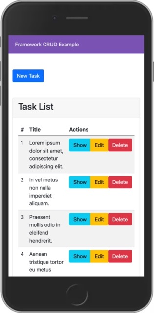
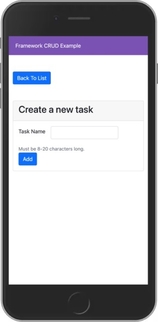
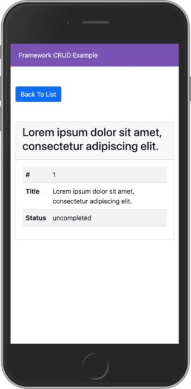
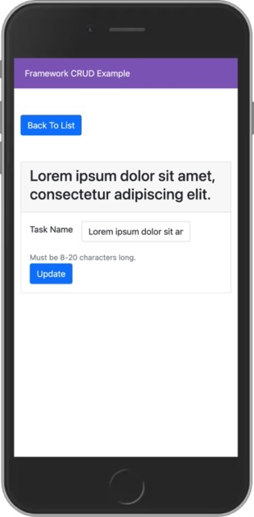

# Framework X CRUD

- Framework X. https://framework-x.org/
- Twig template engine: https://twig.symfony.com. All the templates are used from memory cache.
- Overriding HTTP method to support 'HEAD', 'PUT', 'DELETE', 'CONNECT', 'OPTIONS', 'PATCH', 'PURGE', 'TRACE' methods that are not support by HTML form. For more info -> https://github.com/symfony/http-foundation/blob/6.1/Request.php#L1194
- Sqlite package. https://github.com/clue/reactphp-sqlite
- PHP-watcher. https://github.com/seregazhuk/php-watcher

## Installation
    mkdir framework-x-database-crud
    cd framework-x-database-crud
    git clone git@github.com:mahmutbayri/framework-x-database-crud.git .
    composer install
    php migrate.php

## Live demo 

http://3.64.192.83:3000/tasks

> Depending on when your visit the address might not work.

## Running on local

    X_LISTEN=0.0.0.0:8081 php public/index.php

    // with watcher
    X_LISTEN=0.0.0.0:8081 ./vendor/bin/php-watcher --watch src --watch resources public/index.php --ext=php,twig

Navigate: http://localhost:8081/tasks

## Running on local with docker

    docker image rm -f framework-x-database-crud && docker build -t framework-x-database-crud .
    docker container rm -f framework-x-database-crud-container && docker run --name framework-x-database-crud-container -d -p 8081:3000 -e X_LISTEN=0.0.0.0:3000 framework-x-database-crud
    
    // Clean up
    docker container rm -f framework-x-database-crud-container
    docker image rm -f framework-x-database-crud

Navigate: http://localhost:8081/tasks

## Screenshots

List the tasks

Create a task

Show a task

Edit a task

